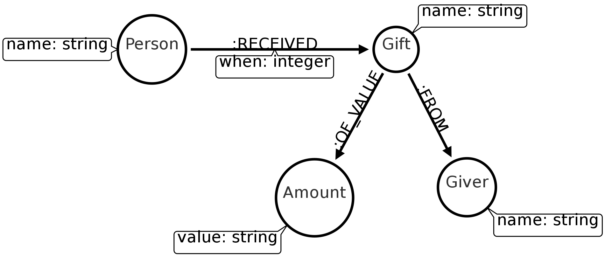
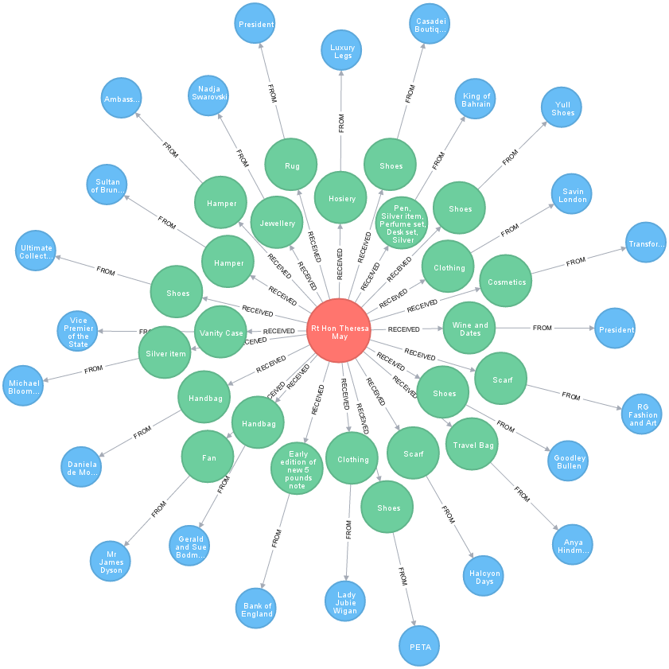

# Play with transparency data

## Get the data
From all the dataset proposed by Marvelous Graph Hacks Team, the one about transparency has been taken.  
And among all the type of information available, only those regarding Gifts will be used for the current data play.  
Data source: https://www.gov.uk/government/collections/ministers-transparency-publications

## Understand the data
Files are mostly CSV, while there is some ODS but columns are the same.  
These files are about gifts received by UK ministers (and prime ministers in particular) in 2016.  
They contains the following columns:

| Column | Description |
| ------------------- | --------------------------------------------------- |
| Minister          | The minister name |
| Date              | The  date the  gift was offered |
| Gift              | What the gift is |
| Given or received | Was the gift given or received (only received one will be used)|
| Who gift was given to or received from | Who offer the gift |
| Value (£) | The gift value |
|Outcome (received gifts only) | won't be used |

## Clean the data
First, we can see two column names with problems:
- `Value (£)`, which is sometimes `Value (x)` where x is an unreadable character which is very unpractical to use when loading csv with headers
- `Outcome (...)` is on two lines. Doesn't seems practical neither.
This particular problem can be easily addressed by not using `WITH HEADERS` and just use the column indices. And skip first line during treatment, of course.  

Next, we can see that, obviously, data are dirty.  
Let's see:
- Minister's name  sometimes start with a "The", sometimes not
- names are on first line, but can be omitted on next lines it doesn't change
- date format are consistenly inconsistent, and contains language-related data (and are therefore not fixable with apoc)
- gift value can contains unreadable characters 

Because of short duration of hackathon and because they were not so much non-empty files, all cleaning was done by hand:
- Set same name for same prime minister
- Add missing minister name
- Format date to YYYY-MM-DD
- Format value to integer

Cleaned files are in the zip (transparency_data.zip).

### Import the data
#### Schema
Now that we know our data and have cleaned the files, let's define the graph schema!


#### Import
Import queries follow the same pattern:
```
// First load the  file (without headers)
LOAD CSV FROM "file:///Cabinet_Office_Ministerial_October_-_December_2016-_Gifts.csv" AS line

// Only treat lines...
WITH line
WHERE 
    // that is not the headers one, ...
    line[1] <> "Date" 
    // has valid data, ...
    AND line[2] IS NOT NULL 
    // An only related to 
    AND apoc.text.clean(line[3]) = "received"

// Create Person node
MERGE (p:Person {name: line[0]})

// Create one node  per  gift (there will be duplicates but that's what we want)
CREATE (g:Gift {name: line[2]})

// Create one node  per amount
CREATE  (a:Amount {value: line[5]})

// Create Giver node
MERGE (giver:Giver{name: line[4]})

// Link Person to gift and add date property to this relationship
MERGE (p)-[:RECEIVED {when: apoc.date.parse(line[1], 's', 'yyyy-mm-dd') }]->(g)

// Link gift to giver
MERGE (g)-[:FROM]->(giver)

// Link gift to its amount
MERGE (g)-[:OF_VALUE]->(a);

//Don't return anything because we are super-confident of what we've done
```


All file needs to be  processed this way.  
Copy them in your `$NEO4J_HOME/import` directory.  
It is possible to launch each query in the  browser or the cyher-shell, but it's even easier to write all the queries in a file (say `transparency.cql`) and to import at once via cypher-shell:
`cat path/to/transparency.cql | cypher-shell -u neo4j_user`
A prompt will ask for password.  
And there it is, all data are available for play!

## Play with data
Let's the fun begin.  

### What do you think is the  most offered gift?
Launch
```
MATCH (g:Gift) 
RETURN g.name AS gift, COUNT(g) AS count
ORDER BY count DESC
LIMIT 5
```
and discover it

### Who do you think receive the most ofered gift
```
// Get the most offered gift
MATCH (g:Gift) 
WITH g.name As gift_name, COUNT(g) AS count
ORDER BY count DESC
LIMIT 1

// And get the person who received it
MATCH (g:Gift {name: gift_name})<-[:RECEIVED]-(p:Person)
RETURN DISTINCT g.name AS gift, p.name AS person, count
```
Oh, really?

### Who received the more gifts from a same  person
```
// Get all givers
MATCH (giver:Giver),

// ... what they give ...
(giver)<-[rel:FROM]-(g:Gift),

// ... to who ....
(g)<-[:RECEIVED]-(p:Person)

// And  return the top 5 givers
RETURN giver.name AS giver, p.name AS receiver, COUNT(rel) AS nb_gifts
ORDER BY nb_gifts DESC
LIMIT 5
```
But why?

### Above limit gifts
Gift value should be under a certain limit. Let's see if there is some above this limit (marked as "above limit" or "over limit")
```
// Get all amounts
MATCH (a:Amount)

WITH 
// Number of "over limit" or "above limit" gifts 
SUM (
    CASE 
        WHEN a.value CONTAINS "limit" THEN 1
        ELSE 0
    END      
) AS above_limit,

//  Number of "regular" gifts
SUM (
    CASE 
        WHEN NOT a.value CONTAINS "limit" THEN 1
        ELSE 0
    END      
) AS regular,

// total number of gift
COUNT(a) AS nb_total_gift,

// Will be  used to compute percentage (be sure to use 100.0 and not 100 to get a float number)
100.0 / COUNT(a) AS perc_basis

// Return total number of gifts, number of "above limit" and regular gifts and respective percentage 
RETURN nb_total_gift, above_limit AS nb_above_limit_gifts, regular AS nb_reguar_gift,  ROUND(above_limit * perc_basis) AS perc_above_limit, ROUND(regular * perc_basis) AS perc_regular
```
oh, wait!

## Last words
The last two query weren't done during the hackathon. To be honest:
- the third one (about who received the more gifts from a same person) is entirely new
- the last one was done in 2 separate queries: one for the "above limit" gifts and one for the "regular" gifts. Idea was just but not completed.

### Bonus
The Theresa May graph:
```
MATCH (p:Person  {name: "Rt Hon Theresa May"}),
(p)-[:RECEIVED]->(g:Gift),
(g)-[:FROM]->(giver:Giver)
RETURN p, g, giver
```


